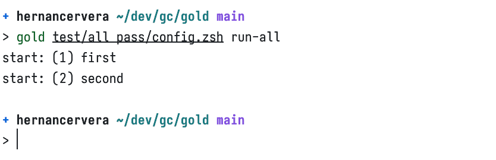
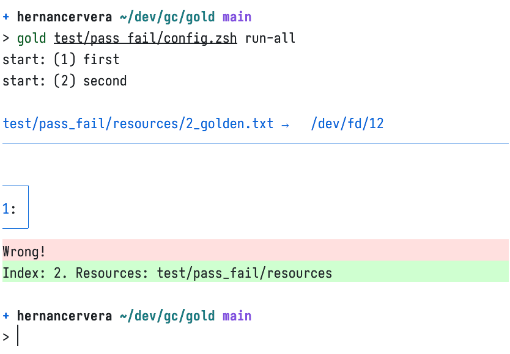

# gold

Gold is a tool written in Zsh for golden testing on stdout/stderr of commands.

<table>
  <tr>
    <th>All pass</th>
    <th>One passes, one fails</th>
  </tr>
  <tr>
    <th></th>
    <th></th>
  </tr>
</table>

## Features

- Name test cases for easy identification in the output.
- Declarative approach, leveraging a Zsh file to provide configuration and resource files.
- Can be used to test software written in any language. The output of the binaries is what is tested.
- When a test case does not pass, the diff is nicely displayed using [delta](https://github.com/dandavison/delta).
- Patch the golden file of test cases currently not passing.

## Requirements

- `zsh` — <https://zsh.sourceforge.io>
  - In macOS this should already be installed.
- `delta` (optional) — <https://github.com/dandavison/delta>

## Installation

Clone this repository, then execute:

```text
ln -v gold /usr/local/bin
```

## Usage

Print the below message with `gold --help`. This is the public API.

```text
gold [--help|-h]
  Display this help message.

gold <config-file> <sub-command>
  <config-file>
    Config file path, written in Zsh, which must define the following parameters:
      - `test_cases`. Numerically indexed array with the name of the test cases. This allows gold
         to know how many test cases should be executed and provides a tag to print for each test.
      - `resources`. Holds the file path to a dir to provide data for the command. At a minimum,
         it is expected that for each test case there is one golden file in this directory with
         the name `<index>_golden.txt`.
      - `command`. Command to execute which output is compared against a golden file. The file can
         be any valid Zsh command. Two strings are replaced before executing the command: <R> with
         the `resources` value and <I> with the test case index (indices begin at 1).
  <sub-command>
    - list: List all test cases.
    - run-all: Run all test cases.
    - run <test-case-index>: Run a single test case, by index.
    - patch-all: Patch (fix with current diff output) all test cases.
    - patch <text-case-index>: Patch (fix with current diff output) a single test case, by index.
```

For an example usage, refer to the directory [test](./test).

To run the first configuration, execute: `gold test/pass_fail/config.zsh run-all`.

## Versioning

<https://semver.org/>

## License

[MIT](./LICENSE)

> THE SOFTWARE IS PROVIDED "AS IS", WITHOUT WARRANTY OF ANY KIND, EXPRESS OR
> IMPLIED, INCLUDING BUT NOT LIMITED TO THE WARRANTIES OF MERCHANTABILITY,
> FITNESS FOR A PARTICULAR PURPOSE AND NONINFRINGEMENT. [...]
